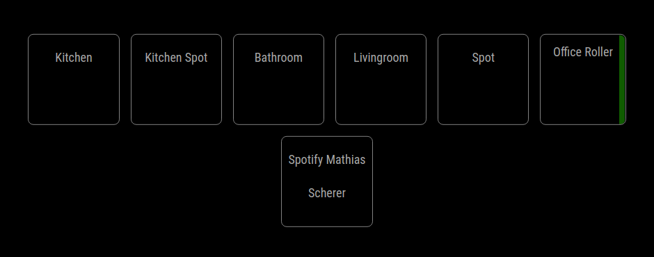
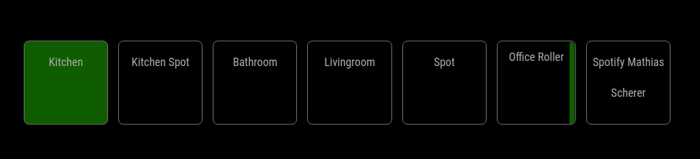

# MMM-HomeAssistant-Touch

This module provides an integration to HomeAssitant with touch controls in the Magic Mirror.
It also supports multiple HomeAssistant hosts and connections. You can achieve this by adding the module multiple times to the config.js with different configurations

Currently the following modules are supported:

- Cover
- Media Player
- Switch
- Light


## Installation  

Navigate into your MagicMirror `modules` folder and execute  

```sh
cd ~/MagicMirror/modules/
git clone https://github.com/everylumi/MMM-HomeAssistant-Touch.git
cd MMM-HomeAssistant-Touch
npm install
```


## Connection

This module requires the token key of the Home Assistant you want to access.


## Config

This are the possible configuration options and the default values set by the module.

```javascript
{
  module: "MMM-HomeAssistant",
  position: "middle_center",
  config: {
    host: "http://127.0.0.1",
    port: 8123,
    token: "NOT_VALID",
    ignoreCert: false,
    entities: ["ENTITY_ID"],
  }
},
```

## Screenshots





## The MIT License (MIT)

Copyright (c) 2021 LUMI

Permission is hereby granted, free of charge, to any person obtaining a copy
of this software and associated documentation files (the "Software"), to deal
in the Software without restriction, including without limitation the rights
to use, copy, modify, merge, publish, distribute, sublicense, and/or sell
copies of the Software, and to permit persons to whom the Software is
furnished to do so, subject to the following conditions:

The above copyright notice and this permission notice shall be included in all
copies or substantial portions of the Software.

THE SOFTWARE IS PROVIDED "AS IS", WITHOUT WARRANTY OF ANY KIND, EXPRESS OR
IMPLIED, INCLUDING BUT NOT LIMITED TO THE WARRANTIES OF MERCHANTABILITY,
FITNESS FOR A PARTICULAR PURPOSE AND NONINFRINGEMENT. IN NO EVENT SHALL THE
AUTHORS OR COPYRIGHT HOLDERS BE LIABLE FOR ANY CLAIM, DAMAGES OR OTHER
LIABILITY, WHETHER IN AN ACTION OF CONTRACT, TORT OR OTHERWISE, ARISING FROM,
OUT OF OR IN CONNECTION WITH THE SOFTWARE OR THE USE OR OTHER DEALINGS IN THE
SOFTWARE.
